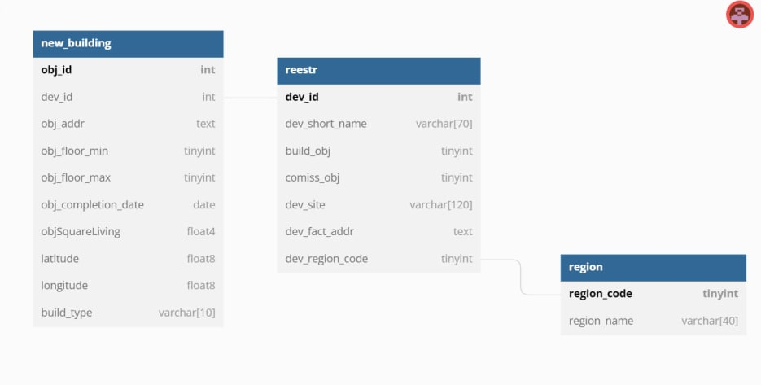

# Freelance tasks
Some solved real problems.
Description in Russian (current group of files):

## Что нужно было сделать:
1. Показать навыки работать с парсерами. Для примера спарсила 2 таблицы с сайта наш.дом.рф.

Ссылка на реестр застройщиков (таблица reestr):

https://clck.ru/sGCvv

Ссылка на каталог новостроек (таблица new_buildings):

https://clck.ru/sGCwR

2. По этим таблицам:
- составить БД в PostgreSQL (была добавлена еще 3 таблица, образованная из 2 имеющихся);
- с помощью движка psycopg2 написать некоторые запросы к БД;
- сделать небольшой анализ полученных данных.

## Схема БД:

